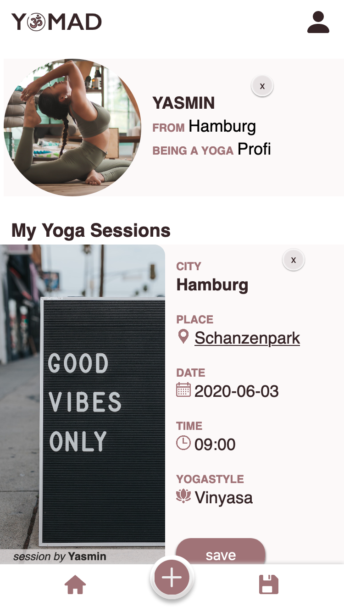

<div align="center">
  
</div>

---

## Be a yoga nomad and meet new people

Yomad shows you yoga spots in your city and allows you to pratice yoga together with others. Let new yoga sessions and styles inspire you and connect yourself with like-minded people - no more lonely YouTube practices or expensive yoga studios.

This app was developed as my capstone project during the final four weeks of the neuefische Web Development Bootcamp in May, 2020.

This app was developed and optimized for mobile usage, so please switch your browser to responsive mode (iPhone 6/7/8)

Take a look at the Yomad app [here](https://yomad-2e8f7.web.app/)

---

## Some impressions of the app

<div align="center">
  
</div>
<div align="center">
  
  
  
</div>
<div align="center">

  
  
</div>

---

## Tech stack, dependencies and all the nice stuff I used
<ul align="left">
<li>React</li>
<li>React Router</li>
<li>React Hooks</li>
<li>styled-components</li>
<li>Storybook</li>
<li>Jest</li>
<li>React Testing Library</li>
  <li>Cypress</li>
  <li>Firebase</li>
  <ul>
  <li>Cloud Firestore</li>
  <li>Storage</li>
  <li>Hosting</li>
  </ul>
  <li>localStorage</li>
  <li>prop-types</li>
  <li>Google Maps URLs</li>
  <li>uuid</li>
  <li>Material-UI</li>
</ul>
---

## Want to set it up?
- clone this repository
- install all npm dependencies   
    ```npm install```
- this app uses firebase storage and firestore, therefore you need to install firebase    
 ```npm install -g firebase-tools```    
 and intialize it to use and deploy the firebase project.
- For more information check out the [firebase documentation](https://firebase.google.com/docs).
- to run Storybook   
```npm run storybook```  
- to run React Testing Library & Jest   
```npm test```
- to run Cypress   
```npm run cypress```
___

## Last but not least
A big THANK YOU to [@neuefische](https://neuefische.de/) in Hamburg for their great program, team and support! ... and of course to all my amazing classmates: I wish every single one of you the best 🍀